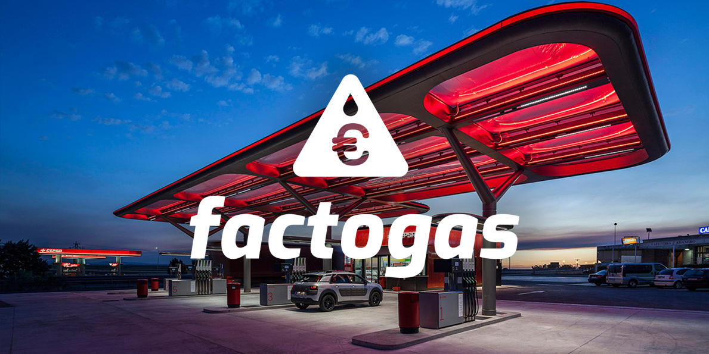

 Factogas, aplicación desarrollada para la Estación de Servicio Algoda. Es una herramienta que facilita la creación de facturas para los clientes y permite gestionar el combustible de la estación ⛽

<hidden>

</hidden>
<zoom-image src="fg-01.jpg" atl='logotipo'></zoom-image>

<divide>

<hidden>

</hidden>
<zoom-image src="fg-02"  alt='mockup-aplicacion'></zoom-image>

<hidden>

</hidden>
<zoom-image src="fg-03"  alt='mockup-aplicacion'></zoom-image>

</divide>
