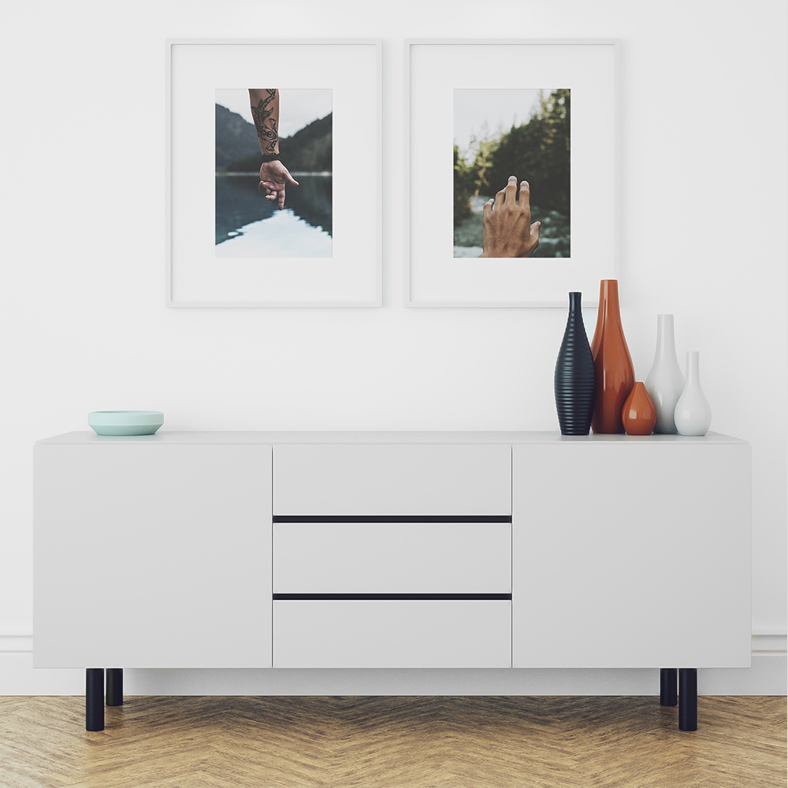

 En Yobo hemos tenido la oportunidad de crear la marca para el fisioterapeuta Nicolás Alcaide.
La calma, cercanía y la innovación en su sector, han sido fuentes de inspiración para este proyecto.
Hemos representado en forma de icono la mano, herramienta de trabajo, trabajando sobre el cuerpo del paciente. Algo tan básico como las manos, pueden ser la solución a muchos problemas, por eso hemos huido de los colores azul y verde que se asocian al sector sanitario y nos hemos quedado con lo esencial, el blanco y el negro.

<hidden>

</hidden>
<zoom-image src="na-01.jpg" atl='logotipo'></zoom-image>

<divide>

<hidden>

</hidden>
<zoom-image src="na-02"  alt='mockup-aplicacion'></zoom-image>

<hidden>

</hidden>
<zoom-image src="na-03"  alt='mockup-aplicacion'></zoom-image>

</divide>

<hidden>

</hidden>
<zoom-image src="na-04.jpg" atl='logotipo'></zoom-image>