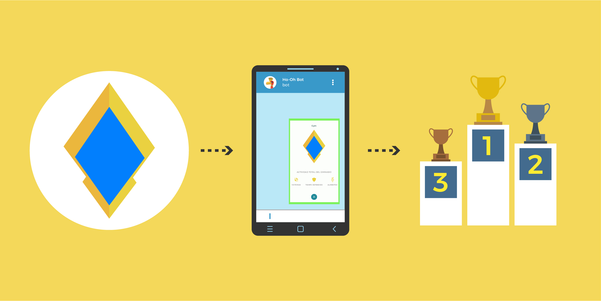

Recibimos un encargo del profesor Willow para crear un bot de Telegram que llevara más allá el juego de Pokémon Go. Decidimos crear un ránking de gimnasios de oro para darle un aliciente más al juego y que este no cayese en la monotonía.

Gracias a este proyecto muchos entrenadores de la zona de Alicante compiten entre ellos de una manera diferente.

<hidden>

</hidden>
<zoom-image src="desarollo-bot-telegram.jpg"></zoom-image>

Para contabilizar los gimnasios simplemente se ha de subir una captura de pantalla del gimnasio al bot instalado en Telegram. Este es capaz de reconocer color y texto para evitar contar gimnasios de plata y bronce además de falsificaciones. Una vez subido, el bot lo verifica y puedes ver tu posición en una tabla de Google Docs.
