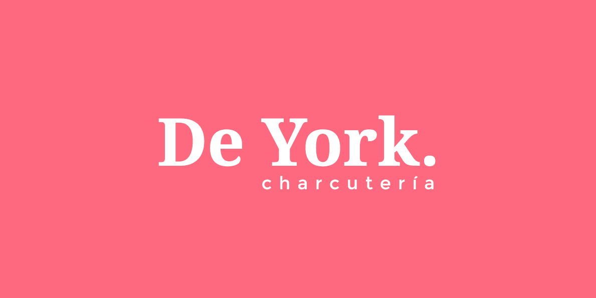
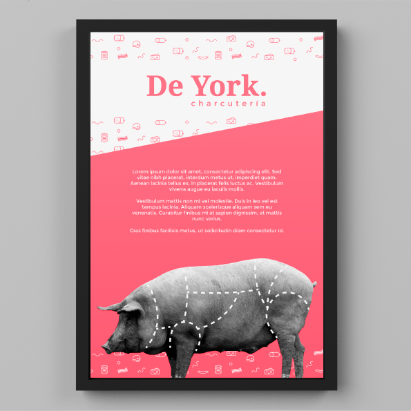
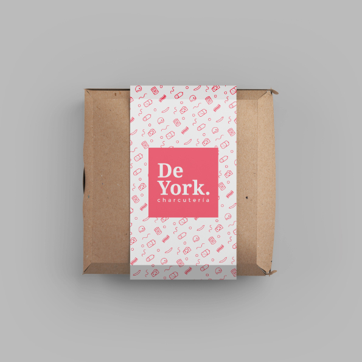
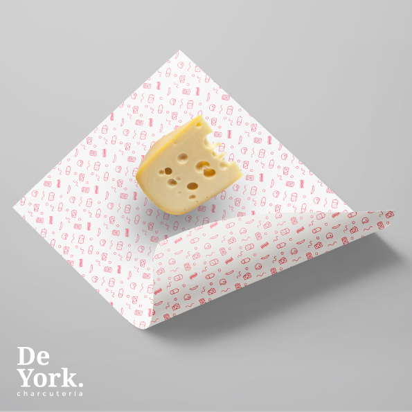
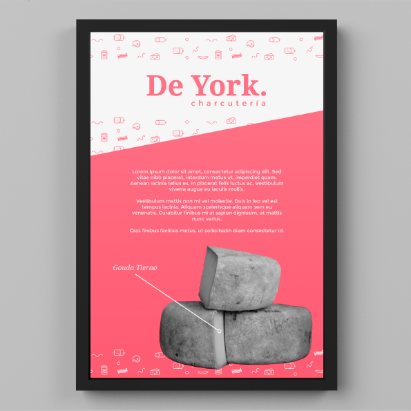
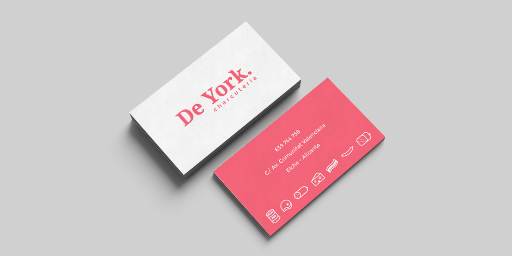

De York es un concepto de branding para una charcutería. En él creamos el naming, logotipo,tarjetas, carteles y otras aplicaciones que podría tener la imagen gráfica de la marca.

Nos ha motivado el pensar que cualquier negocio, por pequeño que sea, puede tener un buen diseño.

<hidden>

</hidden>
<zoom-image src="Img-1-deyork-logotipo.jpg" atl='Logotipo'></zoom-image>

<divide>

<hidden>

</hidden>
<zoom-image src="Img-2-deyork-cartel.jpg"  alt='Cartel'></zoom-image>

<hidden>

</hidden>
<zoom-image src="Img-3-deyork-packaging.jpg"  alt='Packaging'></zoom-image>

</divide>

<divide>

<hidden>

</hidden>
<zoom-image src="Img-4-deyork-packaging.jpg"  alt='Packaging'></zoom-image>

<hidden>

</hidden>
<zoom-image src="Img-5-deyork-cartel.jpg"  alt='Cartel'></zoom-image>

</divide>

<hidden>

</hidden>
<zoom-image src="Img-6-deyork-tarjetas.jpg" atl='Tarjetas de visita'></zoom-image>
