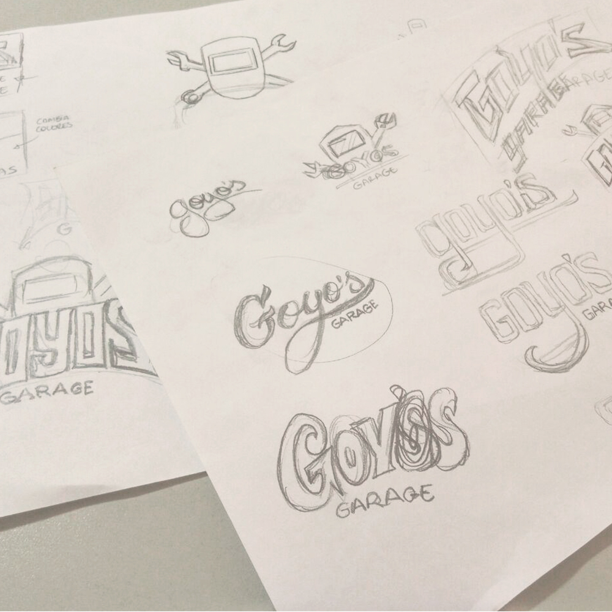
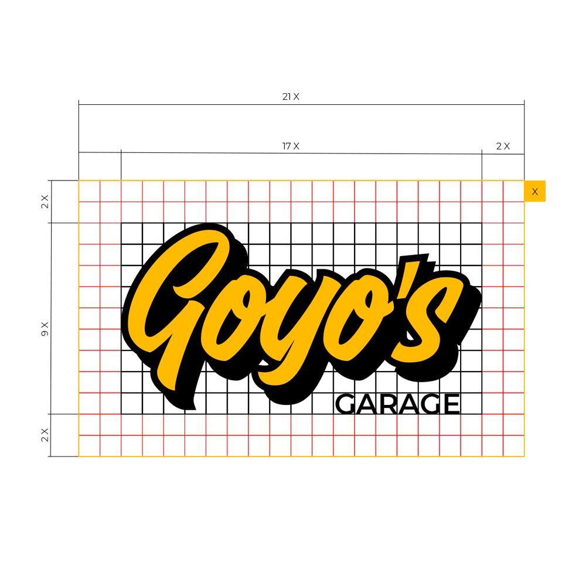
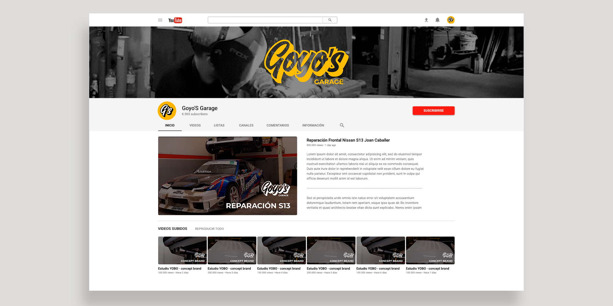

Concept branding del canal de Youtube Goyo's Garage.

Rediseñamos el imagotipo de Goyo basándonos en una tipografía caligráfica que recuerda a los freehand letterings que se hacían antiguamente en los coches. Potencia los valores lo hecho a mano, y lo artesanal, cosas que podemos ver en el canal de Youtube, pero también le da un aire de modernidad que queremos asociar a la marca. La tipografía inferior, para la palabra “garage” es de palo seco, que transmite los valores de racionalidad y equilibrio asociados a la ingeniería y la mecánica.

Se creó un manual de identidad para qué el usuario pudiese aplicar la marca correctamente en sus vídeos, también se diseñaron unas tarjetas de visita y unas imágenes como portadas para Youtube.

<hidden>

</hidden>
<zoom-image src="goyos garage logotipo.jpg" atl='Logotipo'></zoom-image>

<divide>

<hidden>

</hidden>
<zoom-image src="bocetos-logotipo.jpg"  alt='Manual'></zoom-image>

<hidden>

</hidden>
<zoom-image src="espacio-seguridad-goyos.png"  alt='Manual'></zoom-image>

</divide>

<hidden>

</hidden>
<zoom-image src="tarjetas-de-visita-goyos.jpg"  alt='Tarjetas'></zoom-image>

<divide>

<hidden>

</hidden>
<zoom-image src="manual-de-identidad-goyos-01.jpg"  alt='Manual'></zoom-image>

<hidden>

</hidden>
<zoom-image src="manual-de-identidad-goyos-02.jpg"  alt='Manual'></zoom-image>

</divide>

<hidden>

</hidden>
<zoom-image src="canal-youtube.jpg"  alt='Tarjetas'></zoom-image>

