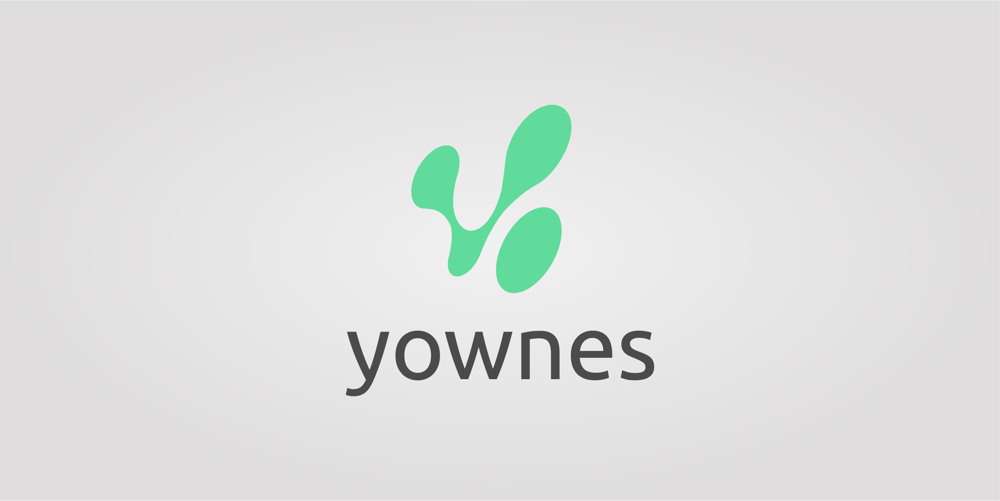
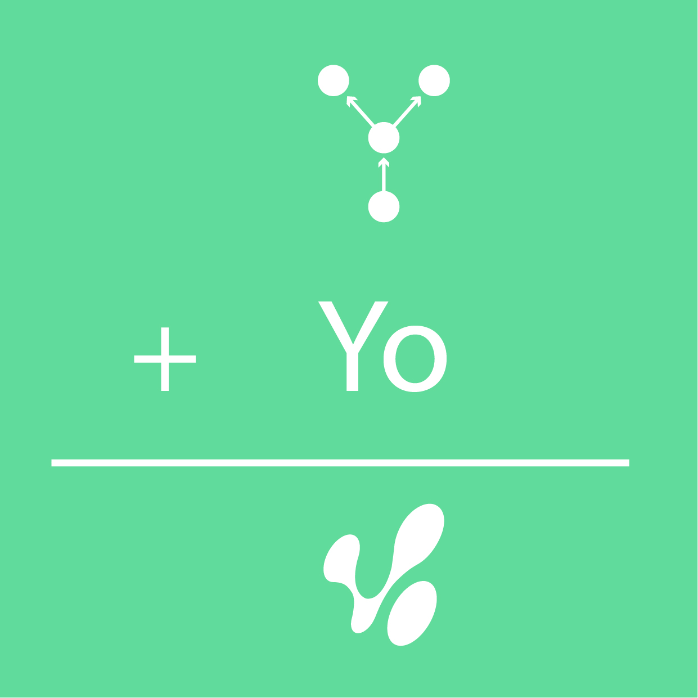
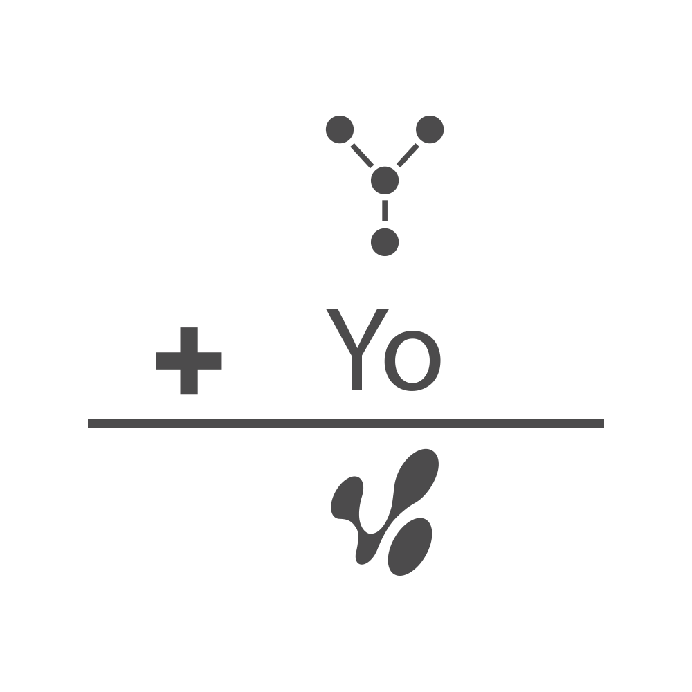

Yownes es un proyecto de creación de naming e imagotipo para una empresa propietaria de un servicio online que se dedica a facilitar la creación de una tienda móvil, en formato app, gracias a su plataforma.

El nombre fue el resultado de jugar y combinar la frase en inglés “Your own e-shop”, tu propia tienda electrónica.

<hidden>

</hidden>
<zoom-image src="yownes1.jpg" zoomSrc='yownes1.jpg' atl='Nombre'></zoom-image>

<divide>
<hidden>

</hidden>
<zoom-image src="yw-02.png"  zoomSrc='yw-02.png' alt='Imagotipo'></zoom-image>

El imagotipo representa las tres fases del servicio: Vendedor, el punto de abajo; la plataforma de creación, el punto central; y los dos puntos superiores, los clientes nuevos a los que accede. Se jugó con esos puntos y se llegó a un resultado que interpretaba las dos letras iniciales del nombre de la empresa.

</divide>
